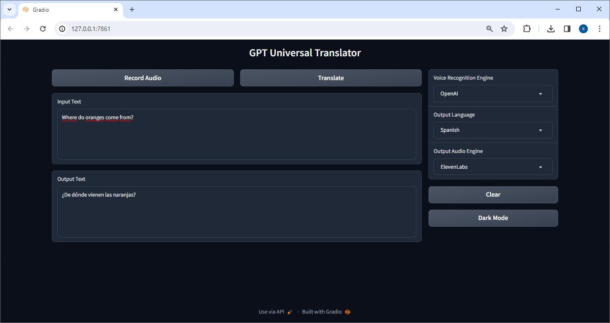

# GPT Universal Translator

## Introduction
The GPT Universal Translator is a Python example application designed to provide near real-time audio-to-text translation using state-of-the-art speech recognition and translation models. This tool leverages the capabilities of Gradio for a user-friendly interface, Google's Text-to-Speech (TTS) and OpenAI's Whisper model and ElevenLabs speech for accurate speech recognition and translation across multiple languages.

## Features
- **Near Real-time Speech Recognition:** Converts spoken language into text using Google's speech recognition or OpenAI's Whisper model.
- **Translation:** Translates text into various languages using OpenAI's GPT models.
- **Text-to-Speech:** Converts translated text back into speech using Google's TTS, OpenAI's TTS or ElevenLabs' speech synthesis.
- **Support for Multiple Languages:** Works with numerous languages including English, Arabic, Chinese, French, German, Spanish, Italian, Portuguese, Russian, Czech, Slovak, Hindi, Greek, Japanese...
- **User-Friendly Interface:** Built with Gradio, providing an easy-to-use graphical interface.



## Installation

### Prerequisites
- Python 3.6 or later
- Pip package manager

### Step-by-Step Guide
1. **Clone the Repository:**
   ```bash
   git clone https://github.com/your-username/gpt-universal-translator.git
   cd gpt-universal-translator
   ```

2. **Install Dependencies:**
   Install the required Python libraries using pip.
   ```bash
   pip install gradio speech_recognition gtts pydub openai elevenlabs python-dotenv
   ```

3. **Environment Variables:**
   Create a `.env` file in the root directory of the project and add your OpenAI and ElevenLabs API keys:
   ```plaintext
   OPENAI_API_KEY=your_openai_api_key
   ELEVENLABS_API_KEY=your_elevenlabs_api_key
   ```

4. **Running the Application:**
   Run the main Python script to start the application.
   ```bash
   python3 app.py
   ```

## Usage
Once the application is running, follow these steps to use the GPT Universal Translator:

1. **Record Audio:** Click the 'Record Audio' button and speak into your microphone.
2. **Select Recognition Engine:** Choose the speech recognition engine (Google, OpenAI).
3. **Translate:** After recording, click 'Translate' to translate the spoken language into your chosen language.
4. **Text-to-Speech:** Listen to the translated text in the chosen language.

## License
This project is licensed under the [MIT License](LICENSE).

## Acknowledgements
- OpenAI for Whisper and GPT models.
- Google for their Text-to-Speech API.
- ElevenLabs for speech synthesis technology.
- Gradio for the user interface framework.

---

**Note:** This application requires API keys from OpenAI and ElevenLabs, which are not provided with the code. Please ensure you have these keys before running the application.
